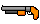
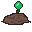

# Fred the Farmer Saves the World
Game Design Fall 2019 Project

Requires SFML for C++

## To Run
1. create a subdirectory called "Release" and open it
2. run "cmake .." (Or however you run cmake on your machine) 
3. run "make" (Or however you usually compile on your machine)
4. run "./application_layer.exe"

## Controls
* **WASD**: Move Fred
* **Mouse**: Aim all attacks
* **Left Mouse Button**: Use selected item
* **1, 2, 3, 4**: Set selected item in inventory
* **E**: Pick up item
* **Q**: Drop selected item
* **X**: Delete selected item (useful for getting rid of extra guns)
* **H**: Advance to end of current cycle (If it's day time, advance the clock to right before the next night)
* **P**: Pause the game

## Item Descriptions
 **Gun**: Ranged weapon that spawn with randomized damage and fire rates

 **Hoe**: Melee weapon that Fred spawns with

 **Health Item**: Restores a portion of Fred's health

 **Speed Boost**: Temporarily makes Fred faster

 **Shield**: Temporarily makes Fred invincible

  **Trap**: Traps that can be set.  Fred can't move when they're being set.  Damage enemies when they collide with set ones.
